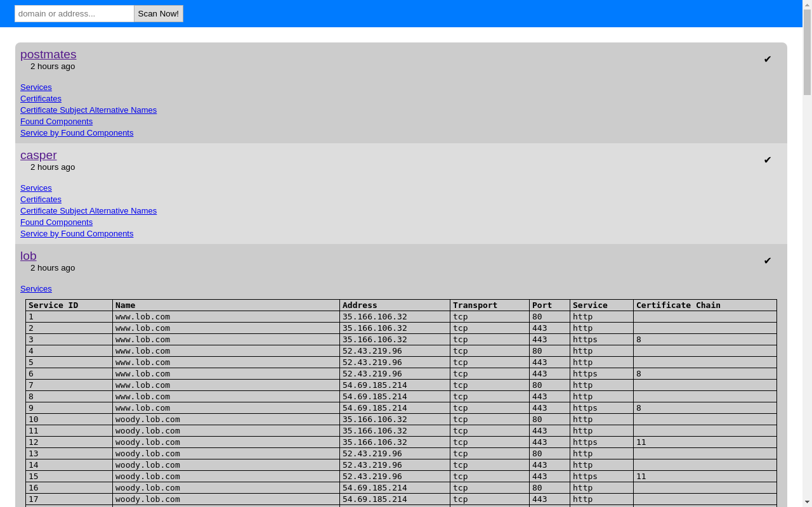

disco-data
==========

This git contains discovery data over time for entities offering bug
bounty programs.

How
---

subjects/<name>.txt contains a newline separated list of domains that are
considered to be in scope for testing. Scoping is done on a by-domain
basis only.

The subject lists are then fed into a machine. The output of that machine
ends up under results/<name>.txt

The tests themselves are intended to chart the territory and no
fuzzing or other intrusive testing of vulnerabilities are performed. This
is not Nessus.

Directory layout
----------------

````
subjects/
  <name0>.txt
  <name1>.txt
  ...
  <nameN>.txt
results/
  <name0>/
    ...
  <name1>/
    ...
  ...
  <nameN>/
    services.csv - Identified services (think open TCP ports for now)
    comp.csv     - Passively identified components
    compsvc.csv  - Components to service mappings
    certs.csv    - Certificate chain information
    sans.csv     - X.509v3 Subect Alternative Names found in certificates
````


Why?
----

This data is provided with the hope that it may be useful to someone.

By itself it's just data, but maybe it can be used to get a good idea of
various bounties using Graphics(tm) and Visualization(tm) (not included).

If you would like to see any interesting data, have ideas, &c I would love
some feedback.

What is this "machine"?
-----------------------

It's a side project. It currently looks like this:



